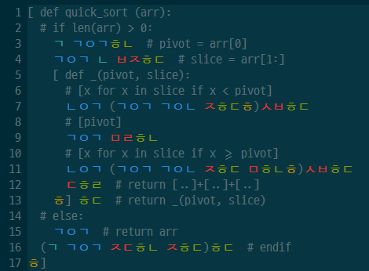

# unsuspected-hangeul-vim
함수형 난해한 언어 '평범한 한글'을 위한 vim 개발 환경입니다.

## 설치 방법
```bash
git clone https://github.com/dragonteros/unsuspected-hangeul-vim.git
cd unsuspected-hangeul-vim

mkdir -p ~/.vim
cp -r ftdetect ~/.vim
cp -r syntax ~/.vim
```

## 구문 강조
Solarized dark 테마 적용 예시


